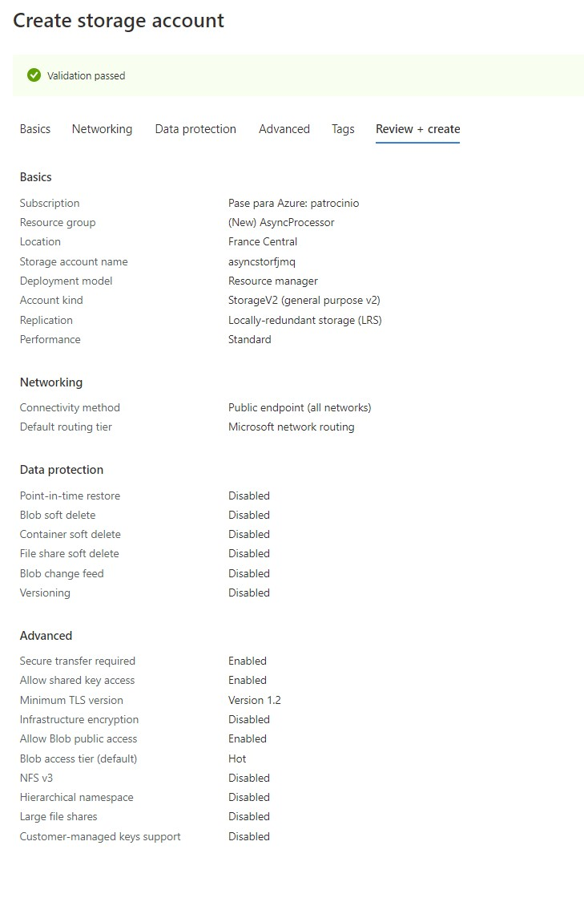
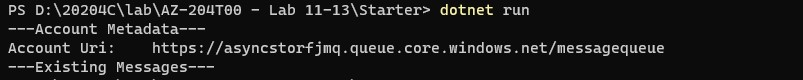
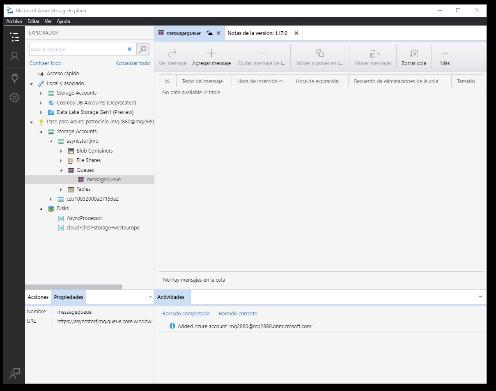
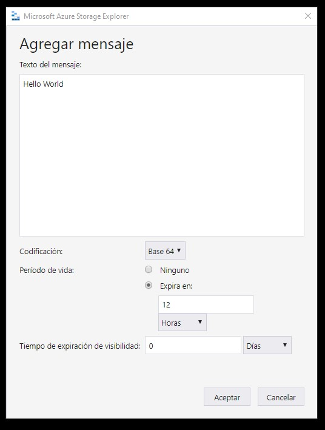
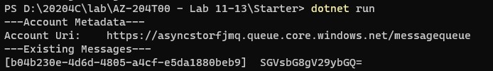
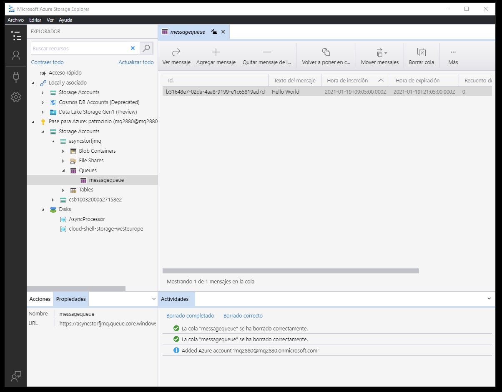
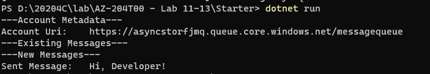
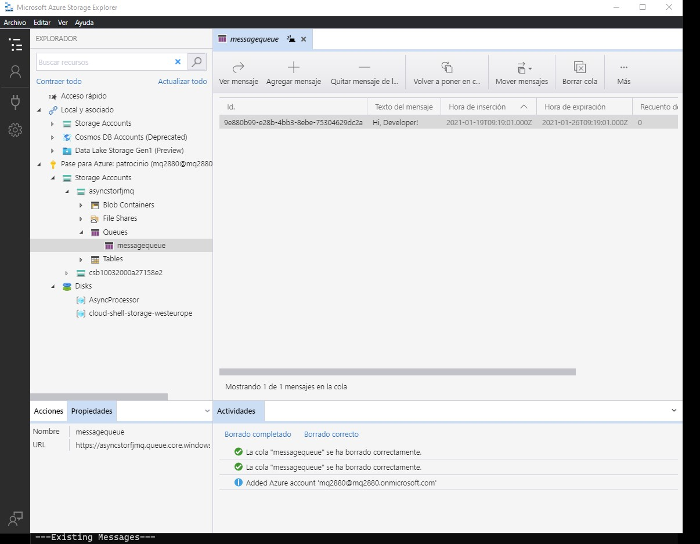

# Module 11 Develop message-based solutions

## Lab: Asynchronously processing messages by using Azure Queue Storage

1. **Nombres y apellidos:** Francisco Javier Moreno Quevedo
2. **Fecha:** 17/01/2021
3. **Resumen del Ejercicio:** Utilizar las colas de almacenamiento con mensajes desde una aplicacion 
4. **Dificultad o problemas presentados y como se resolvieron:** Ninguna

### Exercise 1: Create Azure resources

Crear una **Storage account**



#### Exercise 2: Configure the Azure Storage SDK in a .NET project 

Creamos el proyecto **MessageProcessor**

```
dotnet new console --name MessageProcessor --output .
```


Añadimos el paquete**Azure.Storage.Queues** 

```
dotnet add package Azure.Storage.Queues --version 12.0.0
```

#### 

El **Program.cs** lo borramos y añadimos el siguiente codigo:

```
using Azure;
using Azure.Storage.Queues;
using Azure.Storage.Queues.Models;
using System;
using System.Threading.Tasks;

public class Program
{
    private const string storageConnectionString = "<storage-connection-string>";
    private const string queueName = "messagequeue";

    public static async Task Main(string[] args)
    {
        QueueClient client = new QueueClient(storageConnectionString, queueName);
        await client.CreateAsync();

        Console.WriteLine($"---Account Metadata---");
        Console.WriteLine($"Account Uri:\t{client.Uri}");

        Console.WriteLine($"---Existing Messages---");
        int batchSize = 10;
        TimeSpan visibilityTimeout = TimeSpan.FromSeconds(2.5d);

        Response<QueueMessage[]> messages = await client.ReceiveMessagesAsync(batchSize, visibilityTimeout);

        foreach (QueueMessage message in messages?.Value)
        {
            Console.WriteLine($"[{message.MessageId}]\t{message.MessageText}");
        }
    }
}
```

EJecutamos



Vemos que no hay mensajes


#### Exercise 3: Add messages to the queue 

Abrimos  **Microsoft Azure Storage Explorer**



Creamos un nuevo mensaje



Ejecutamos de nuevo



COmprobamos que hay un mensaje



Modificamos el codigo para borrar los mensajes añadiendo dentro del for la siguiente linea


```
await client.DeleteMessageAsync(message.MessageId, message.PopReceipt);
```

EJecutamos y vemos que una vez leido se borra


#### Exercise 4: Queue new messages by using .NET

Añadimos en el **main** al final el siguiente codigo:

```
    Console.WriteLine($"---New Messages---");
    string greeting = "Hi, Developer!";
    await client.SendMessageAsync(greeting);
    
    Console.WriteLine($"Sent Message:\t{greeting}");
```

Ejecutamos y comprobamos




